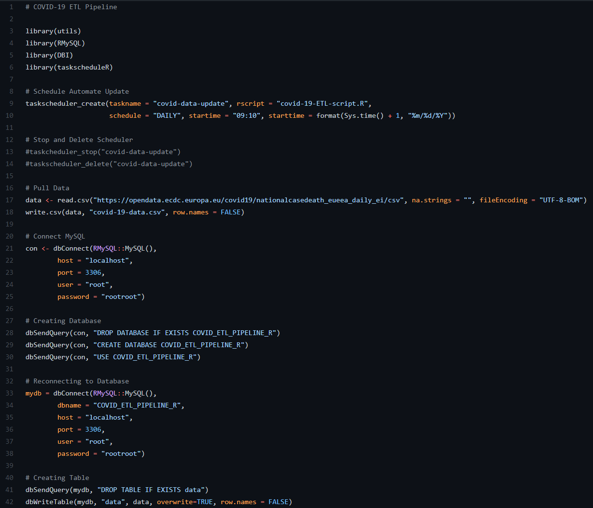

# **Basic COVID-19 ETL Pipeline (R)**

# About the Project

[Pipeline Code Here](https://github.com/AspiringDSer/Basic-COVID19-ETL-Pipeline-R/blob/master/covid-19-ETL-script.R)

Created an automatic extraction pipeline to gather COVID-19 data daily at 9:10am from [ECDC](https://www.ecdc.europa.eu/en/publications-data/data-daily-new-cases-covid-19-eueea-country). The extracted data will then be stored in MySQL for further querying. 

I also made a [R notebook](https://github.com/AspiringDSer/Basic-COVID19-ETL-Pipeline-R/blob/master/covid_19-notebook.Rmd) for easy viewing of the data. You need to render the notebook in HTML. Please input `rmarkdown::render('covid_19-notebook.Rmd')` in the R Studio console. 

**Packages Used:**
* utils
* dplyr
* DT 
* ggplot2
* taskscheduleR 
* DBI
* RMySQL

# Future Development 
* Add CHANGELOG
* Add Unit Testing 
